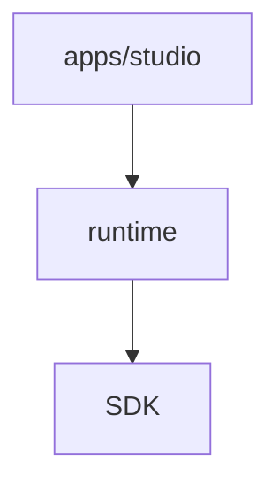

# ADR-002: v0.2 Architecture Freeze & Platform Foundation

## Status
**Status:** Approved / Frozen
**Date:** July 2026

## Context
With the completion of EPIC-5 and EPIC-5.1, Automation Studio has transitioned from a monolithic IDE shell into a modular Automation Operating System. To ensure stability as we develop complex capabilities (Recorder, Inspector, Framework Plugins) in EPIC-6 and beyond, we are freezing the core architectural contracts established in v0.2.0.

## 1. Package Dependency Graph

The monorepo is strictly layered to prevent circular dependencies. Downstream packages must NEVER import from upstream packages.

```mermaid
graph TD
    A[apps/studio (VS Code IDE)] --> B[runtime]
    A --> C[@automation-studio/registry]
    
    B --> C
    B --> D[@automation-studio/context]
    B --> E[@automation-studio/sdk]
    
    C --> E
    
    E --> F[@automation-studio/types]
    
    D --> F
    
    F --> G[@automation-studio/shared]
```

## 2. Plugin Lifecycle

All plugins (frameworks, reporters, recorders) must adhere to the `IPluginLifecycleManager` state machine:
1. **Discovered**: Manifest parsed, metadata available.
2. **Loading**: Dependencies resolved, sandbox initialized.
3. **Active**: `activate()` called, hooks registered.
4. **Disabled**: Execution blocked, UI hooks removed.
5. **Unloading**: `deactivate()` called, memory cleared.

> [!WARNING]
> Plugins must never be instantiated directly via `new Plugin()`. All instantiations must route through `@automation-studio/registry`'s `PluginLoader` to ensure Sandbox wrapping and dependency resolution.

## 3. Execution Lifecycle

The runtime engine enforces a strict hierarchical context. Plugins and executors must hook into these specific events:
- `onGlobalStart(GlobalContext)`
- `onSuiteStart(SuiteContext)`
- `onScenarioStart(ScenarioContext)`
- `onStepStart(StepContext)`
- `onStepEnd(StepContext)`
- `onScenarioEnd(ScenarioContext)`
- `onSuiteEnd(SuiteContext)`
- `onGlobalEnd(GlobalContext)`

## 4. Extension Points

The IDE provides predefined extension points that plugins can hook into via `CapabilityRegistry`:
- `executor`: Executes automation scripts.
- `recorder`: Generates automation scripts from user actions.
- `inspector`: Identifies UI elements.
- `reporter`: Formats and outputs execution results.

## 5. SDK Versioning Policy

- `@automation-studio/sdk` and `@automation-studio/types` strictly follow **Semantic Versioning (SemVer)**.
- Any change to `IAction`, `IFrameworkLifecycle`, or `AutomationPluginManifest` constitutes a **Major (Breaking)** change.
- Plugins explicitly declare their required engine version in their manifest (`engine: ">=0.2.0"`).

## 6. Folder Conventions

- `/apps/studio`: Strictly for VS Code UI, Commands, and Webviews. No automation logic.
- `/runtime`: Orchestration, execution manager, and artifact generation.
- `/packages/*`: Portable SDKs, utilities, and registries completely independent of VS Code or Node.js specifics where possible.

## 7. The Core Never Knows Technologies

The core IDE and runtime must NEVER contain hardcoded logic for specific technologies.
For example, this is **forbidden**:
```typescript
if (framework === "playwright") { ... }
if (framework === "desktop") { ... }
```

Instead, the core must resolve capabilities abstractly via the `TechnologyRegistry`:
```typescript
const inspector = registry.resolveByCapability("inspector");
// or
const recorder = registry.resolve({ capability: "recorder", technology: "playwright" });
```
This ensures the platform remains infinitely extensible without modifying the core.

## 8. The Runtime Never Knows VS Code

The `runtime`, `packages/*`, and plugin code must NEVER import from the `vscode` module or rely on IDE-specific behavior.



The Runtime must be completely independent, allowing it to be reused directly by:
- A CLI runner
- A CI/CD executor
- A Future Web IDE or Desktop IDE

## 9. Capabilities are Preferred over Types

Avoid tightly coupling to plugin IDs. Instead of requesting `registry.resolve("playwright")`, request the *capability* you need (e.g. `registry.resolveByCapability("recorder")`). This allows users to seamlessly swap out the underlying technology driving the recorder without changing the runtime orchestration.

## 10. Core Objects are Immutable

Core orchestration objects like `ExecutionContext` should never be mutated directly in place.

**Forbidden:**
```typescript
context.variables["username"] = "admin";
```

**Required:**
```typescript
const newContext = context.withVariable("username", "admin");
```

Immutability ensures that replaying execution, time-travel debugging, timeline generation, distributed execution, and AI analysis are radically simpler to implement later.

## 11. Breaking Change Policy

From v0.2.0 onward:
- We do not modify the core `ExecutionContext` structure or `IFrameworkLifecycle` without a formal ADR.
- We will deprecate old APIs for at least one minor version before removal.
- If a plugin API changes, the `engine` version requirement MUST be bumped.

> [!IMPORTANT]
> By freezing this architecture now, EPIC-6 (Inspector Plugin) and beyond can be developed entirely as independent Plugins using these frozen SDK contracts, proving the viability of the platform.
